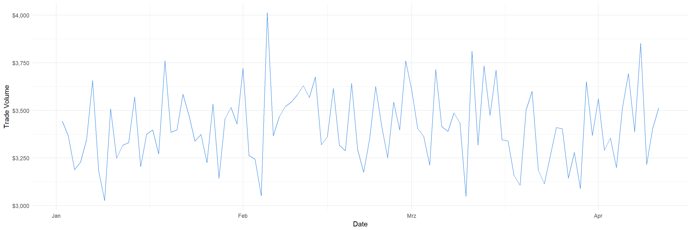
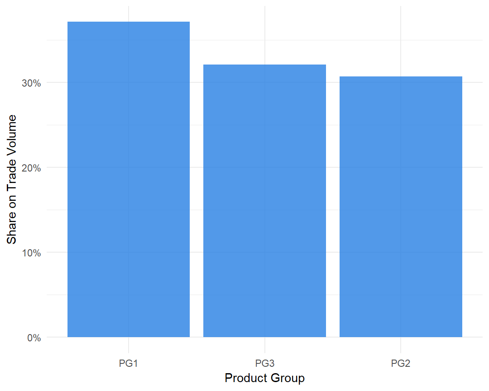
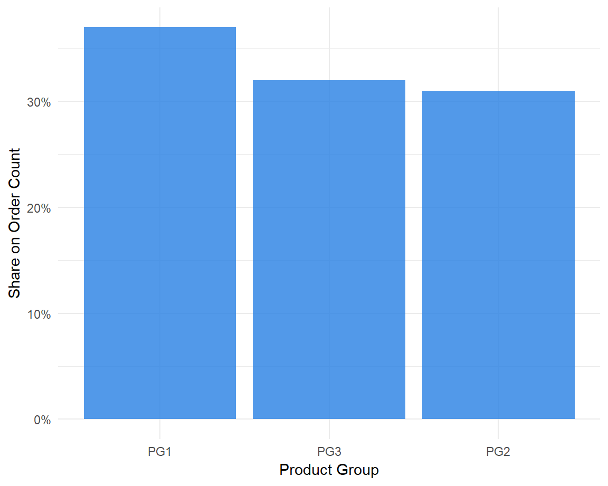
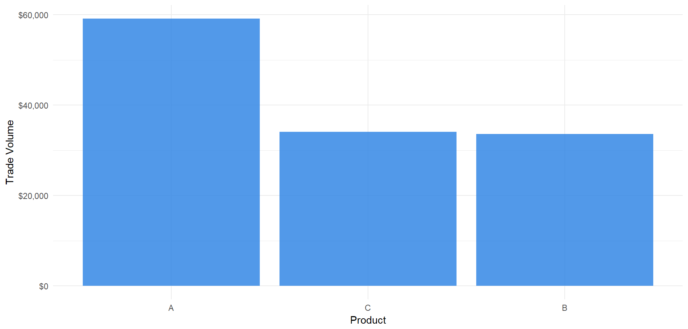
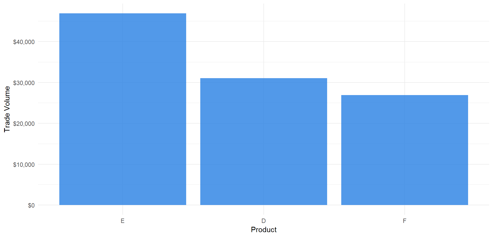
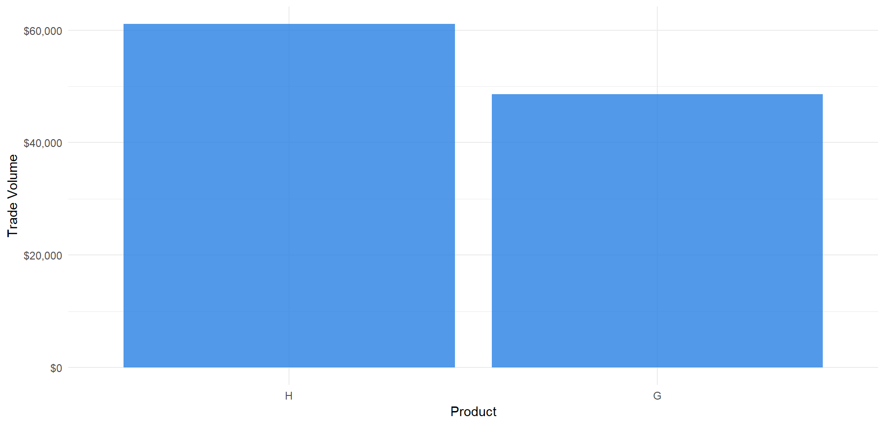

# Overview

<!--html_preserve--><h1 style="text-align:center">Overview</h1><!--/html_preserve-->

Row
-----------------------------------------------------------------------

### Trade Volume Development

Row
-----------------------------------------------------------------------

### Product Group Share on Trade Volume

### Product Group Share on Order Count

#PG1{data-navmenu="Product Groups"}

<!--html_preserve--><h1 style="text-align:center">PG1</h1><!--/html_preserve-->

Row
-----------------------------------------------------------------------

### Product Share on Trade Volume

### Products with Most Trade Volume

Product    Trade Volume [€]
--------  -----------------
A                  59164.85
C                  34086.74
B                  33582.83

#PG2{data-navmenu="Product Groups"}

<!--html_preserve--><h1 style="text-align:center">PG2</h1><!--/html_preserve-->

Row
-----------------------------------------------------------------------

### Product Share on Trade Volume

### Products with Most Trade Volume

Product    Trade Volume [€]
--------  -----------------
E                  46929.80
D                  31012.64
F                  26875.04

#PG3{data-navmenu="Product Groups"}

<!--html_preserve--><h1 style="text-align:center">PG3</h1><!--/html_preserve-->

Row
-----------------------------------------------------------------------

### Product Share on Trade Volume

### Products with Most Trade Volume

Product    Trade Volume [€]
--------  -----------------
H                  61140.92
G                  48569.96

